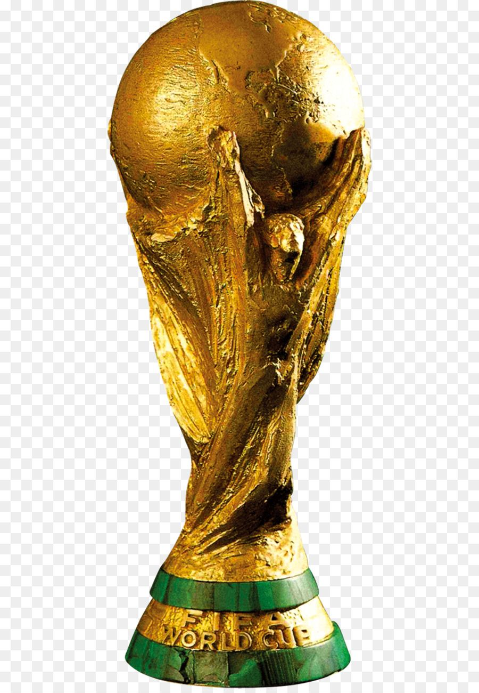

***

 
*This is our final project titled Soccer Stats*  
  
  
  
  

**Soccer is LIFE!**  

>“In football (soccer), the result is an impostor. You can do things really, really well but not win. There’s something greater than the result, more lasting – a legacy.” – Xavi - Spain international player (2000 - 2014)

