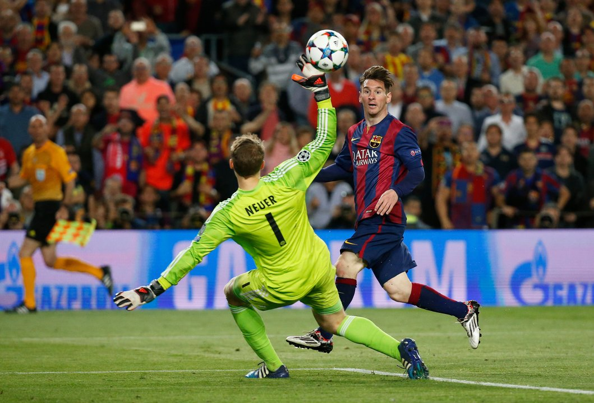

***

**Motivation**

Originated in twelfth-century England, soccer (or football) is the world’s most popular sport. For you to have an idea of soccer's popularity, the last World Cup was viewed by more than 4 billion people. Based on that you may ask: -"Why is soccer so popular"?  The immense popularity that soccer has across the world is due to its universally adoption, meaning that soccer is played globally instead of just in one region. In addition, other factors such as its accessibility (it is very cheap to play soccer) and simplicity (it is easy to play and it can basically be played anyhow anywhere), significantly contribute to making it even more popular.

European soccer leagues are specially well known due to their history, quality of the teams and players, and number of fans that watch their matches.According to Rafal Stepień (2021), the current top five European Leagues are as follows: Premier League (England), La Liga (Spain), Serie A (Italy), Ligue 1 (France), and Bundesliga (Germany). 

Recently, soccer fans and managers started to demand more information about player's performance, including number of goals, assists, position, what leagues and teams they are playing for, etc. All of this information is important because it not only adds depth to fans experience, but also because it influences players and teams market value, which are extremely useful information in financial management of soccer clubs, and serves as a way for teams to gather information about their opponents and their tactics (I would personally pay more attention to a player who has scored 30 goals in a year than a player who has scored 2 goals in a year). As an example, a club's manager could buy a player for $20 million without even watching who is being bought, based only on the player's numeric performance provided by data analytics.

Therefore, the purpose of this project is to utilize quantitative data to generate soccer stats summaries for the top 5 European Leagues as a way to provide readers with some knowledge on where the best performing players are playing at and for, how many goals they have scored, what are their nationalities, and etc.
 
 

**Research Questions**

* *1 Who are the top 5 most valuable soccer players, what is their nationality, position, team (squad), and how many goals did they score in the 2018/2019 season?*

* *2 What are the soccer teams (squad) and leagues for which the top scorers played?*

* *3 What are the top 10 nationalities with the highest number of goals scored by their top 5 scorers?*

  

 **Data**
 
   

 

We used data publicly available on Kaggle.com which was gathered and merged by Rafal Stepień from transfermarkt.de and fbred.com. Transfermarkt.de is the most prominent website related to football transfers, and fbref.com is a website that provides a lot of soccer statistics for free. The data set and the description of how it was gathered and merged can be found in Rafal Stepień's Github page. This data set has all the information needed to answer the questions above. It contains approximately 200 variables and 2000 rows/observations, which represents information for all players in the 5 leagues mentioned above, including player's name, nationality, number of goals, assists, position, value, teams they were playing for, league, cards, and a lot more.

***

**Analysis Plan and Main Results**

In order to answer our research questions, we utilized a diverse range  of analytical and visualization tools, which included tables (GT Tables, Q1 & Q2), Interactive visualizations (GGplot and plotly, Q1,Q2 & Q3), the use of maps (Leaflet, Q3) and the development of a shinny app (Q3). 

Our first question focused on investigating which players had the highest value during the 2018/2019 season. Our results, showed an association between the value of players and the number of goals scored during the 2018/2019 season. In addition, a large proportion of the most valuable players were forwards (strikers). The second part of our analysis focused on analyzing the leagues, teams and nationality of the top scorers in the 2018/2019 season. We found that 6,5,3,3 and 2 players were playing in the Premier League, La Liga, Serie A, Ligue 1 and Bundesliga, respectively. Additionally, the top 10 countries with the highest number of goals by their top 5 scorers were from countries in Europe (n=6), South America (n=3) and Africa (n=1).

***

*“In football (soccer), the result is an impostor. You can do things really, really well but not win. There’s something greater than the result, more lasting – a legacy.” – Xavi - Spain international player (2000 - 2014)*